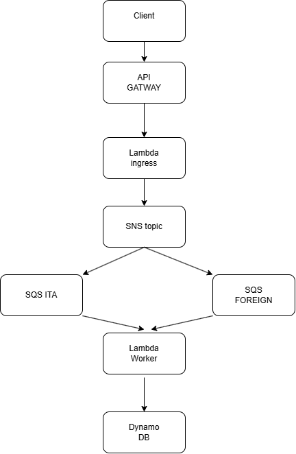

# AWS Serverless Contact Routing

## Overview

This project demonstrates a simple event-driven serverless architecture on AWS.

The application exposes an API for collecting user contacts and routes requests through AWS messaging services before persisting data into DynamoDB.

The purpose of this repository is architectural and educational rather than production-oriented.

---

## Architecture



---

## Use Case

A client submits:

```json
{
  "name": "Mario Rossi",
  "phone": "+39333111222"
}
